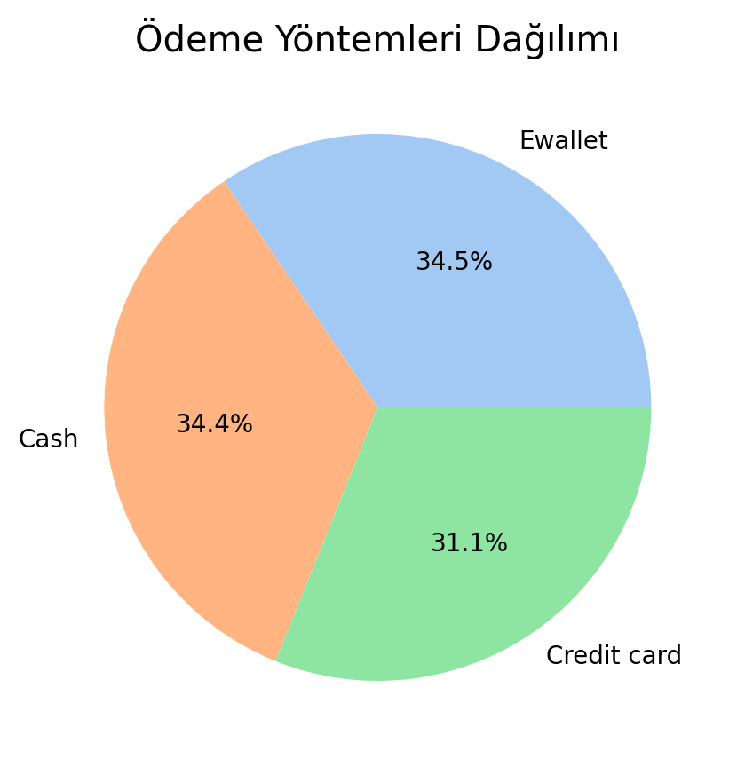
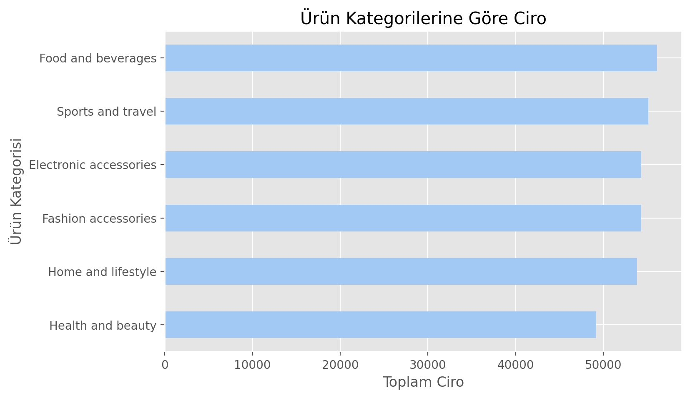
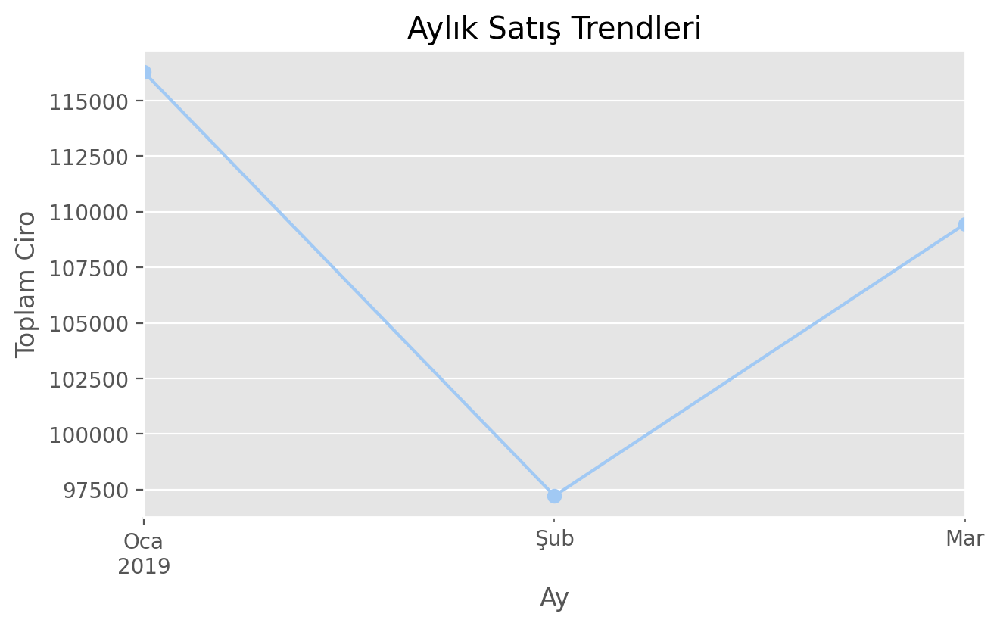
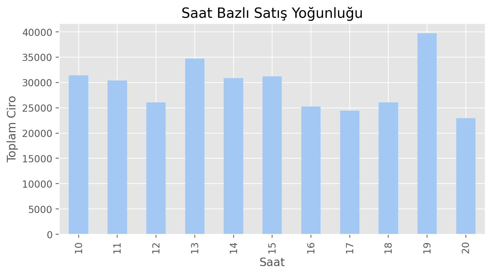
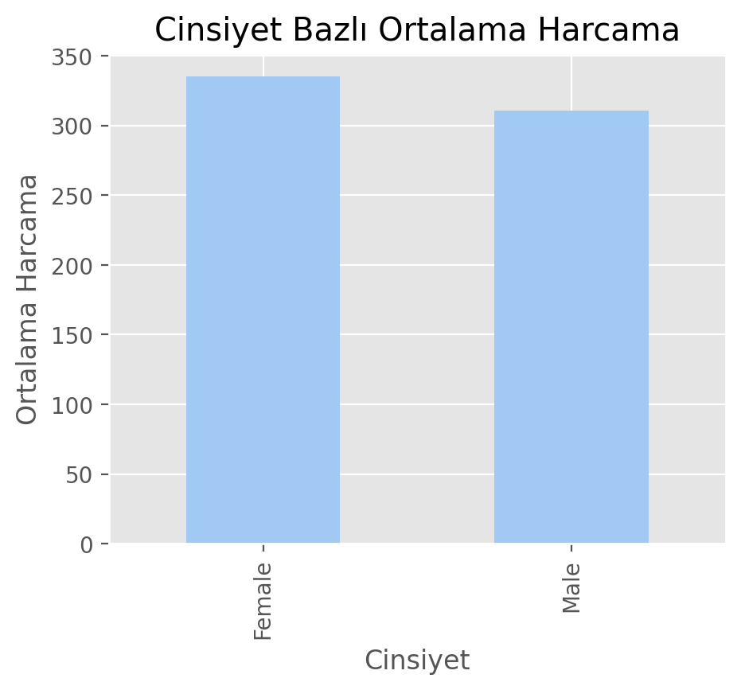
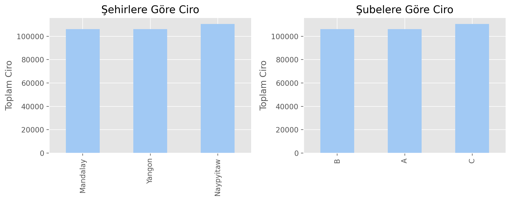
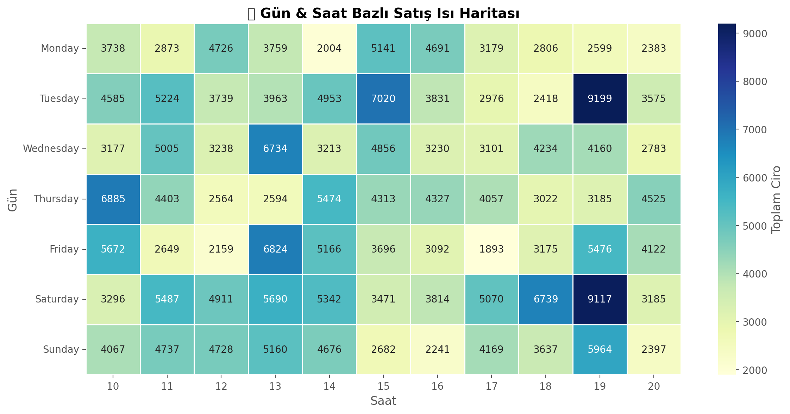
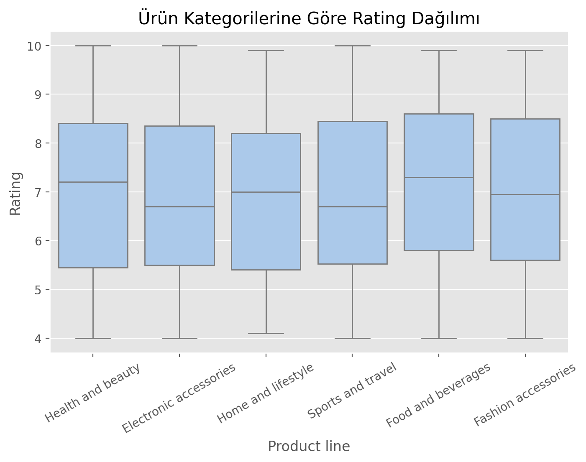

# Supermarket Sales Analizi

Bu proje, *supermarket satış verilerini* analiz ederek müşteri davranışlarını, ödeme yöntemlerini ve satış trendlerini ortaya koymaktadır. Analiz, Python (Pandas, Matplotlib, Seaborn) kullanılarak yapılmıştır.

---

## 🔍 Öne Çıkan Bulgular
- **En çok tercih edilen ödeme yöntemi:E wallet  %34.5
- **Ciro lideri ürün kategorisi:Food and beverages  
- **Pik satış ayı: Ocak 
- **En yoğun satış saati:19
- **Cinsiyet bazlı: Erkek müşteriler daha fazla harcama yapıyor.  

---

## Görselleştirmeler
### Ödeme Yöntemleri

### Ürün Kategorisi Ciro

### Aylık Satış Trendleri

### Saat Bazlı Yoğunluk

### Cinsiyet Bazlı Ortalama Harcama

### Şehir & Şube Karşılaştırması

### Gün & Saat Bazlı Isı Haritası

### Rating Dağılımı

---

## Kullanılan Teknolojiler
- Python  
- Pandas, Matplotlib, Seaborn  

---

## Kaynak
Dataset: Supermarket Sales (Kaggle)
